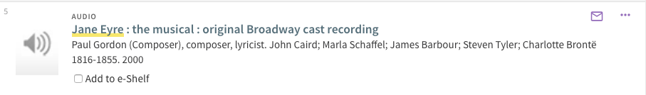
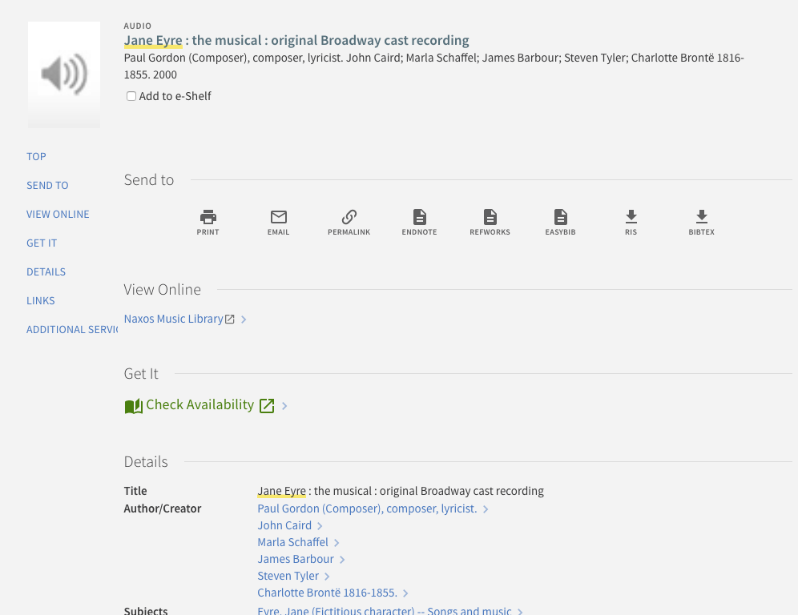
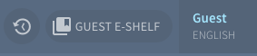

# primo-explore-nyu-eshelf

## Description

Add custom NYU E-Shelf functionality.

### Screenshot

#### Example 1: In brief results


#### Example 2: In full display


#### Example 3: In toolbar


## Installation

1. Assuming you've installed and are using [primo-explore-devenv](https://github.com/ExLibrisGroup/primo-explore-devenv).

2. Navigate to your template/central package root directory. For example:
    ```
    cd primo-explore/custom/MY_VIEW_ID
    ```
3. If you do not already have a package.json file in this directory, create one:
    ```
    npm init -y
    ```
4. Install this package:
    ```
    npm install primo-explore-nyu-eshelf --save-dev
    ```

## Usage

Once installed, inject `nyuEshelf` as a dependency:

```js
let app = angular.module('viewCustom', ['nyuEshelf'])
```

**Note:** If you're using the --browserify build option, you will need to first import the module with:

```js
import 'primo-explore-nyu-eshelf';
```

### In brief and full results

To enable the checkbox after the availability line configure the following component:

```js
app
  .component('prmSearchResultAvailabilityLineAfter', {
    template: '<nyu-eshelf></nyu-eshelf>'
  })
```

### In toolbar

To add a link to your external e-Shelf in the toolbar configure the following component:

```js
app
  .component('prmSearchBookmarkFilterAfter', {
    template: '<nyu-eshelf-toolbar></nyu-eshelf-toolbar>'
  })
```

### Disable out of the box "Saved Records" functionality

If you want to fully hide the existing "Saved Records" functionality and exclusively use the custom e-Shelf add the following CSS:

```js
// Disable built in e-shelf
.pin-button,
prm-favorites-labels,
prm-search-bookmark-filter a[aria-label='Go to my favorites'],
prm-search-bookmark-filter a[aria-label="nui.favorites.goFavorites.tooltip"],
prm-favorites md-tab-item:first-child {
  display: none !important;
}
```

### Config

You'll need to configure the module by passing it an object as an angular `constant` called `nyuEshelf`:

| name | type | usage |
|------|-------------|--------|
| `myEshelf` | string | text for toolbar link when user is signed in |
| `guestEshelf` | string | text for toolbar link when user is signed out |
| `addToEshelf` | string | text for checkbox label when record is not in e-shelf |
| `inEshelf` | string | text for checkbox label when record is in e-shelf and user is signed in |
| `inGuestEshelf` | string | text for checkbox label when record is in e-shelf and user is signed out |
| `loginToSave` | string | text prompting user to sign in to save temporary records |
| `adding` | string | text for checkbox label when adding to e-shelf |
| `deleting` | string | text for checkbox label when removing from e-shelf |
| `error` | string | text for checkbox label when there is an error |
| `pdsUrl` | object | to how to build the login PDS url with three values: `base`, `callingSystem`, `institution` |
| `eshelfBaseUrl` | string | base url for the external e-shelf |


### Example

The below are the defaults, they should be updated for production:

```js
app.constant('nyuEshelf', {
  myEshelf: 'My e-Shelf',
  guestEshelf: 'Guest e-Shelf',
  addToEshelf: "Add to e-Shelf",
  inEshelf: "In e-Shelf",
  inGuestEshelf: "In guest e-Shelf",
  loginToSave: "login to save permanently",
  adding: "Adding to e-Shelf...",
  deleting: "Removing from e-Shelf...",
  error: "Could not connect to e-Shelf",
  pdsUrl: {
    base: 'https://pdsdev.library.nyu.edu/pds',
    callingSystem: 'primo',
    institution: 'NYU-NUI'
  },
  eshelfBaseUrl: 'https://qa.eshelf.library.nyu.edu'
});
```
